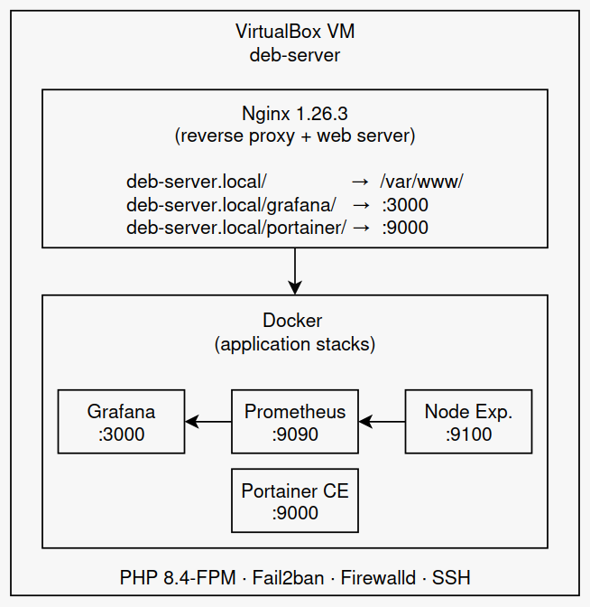
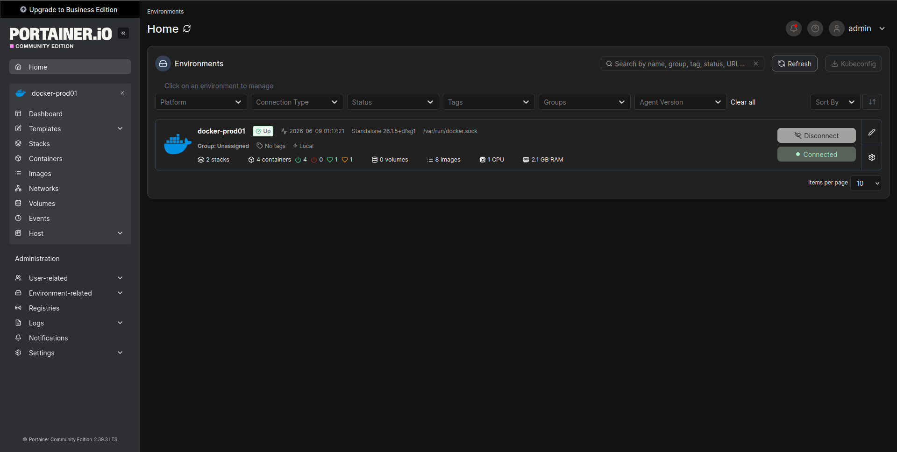
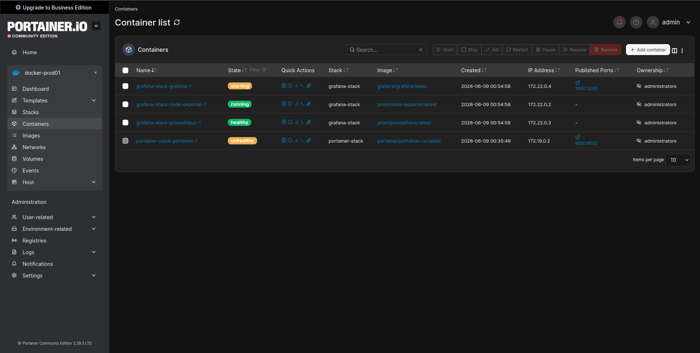

# deb-server — Home Lab


Personal home server running as a VirtualBox VM on a local machine. Used for self-hosting, monitoring, and experimenting with server infrastructure.

## Overview

| Property     | Value                             |
| ------------ | --------------------------------- |
| **Hostname** | `deb-server`                      |
| **OS**       | Debian GNU/Linux 13 (Trixie) 13.4 |
| **Kernel**   | Linux 6.12.74 amd64               |
| **Platform** | VirtualBox (Oracle VM)            |
| **Local IP** | `192.168.0.101`                   |
| **Domain**   | `deb-server.local`                |

## Hardware (VM specs)

| Component  | Details                               |
| ---------- | ------------------------------------- |
| **CPU**    | Intel Xeon E31230 @ 3.20 GHz (1 vCPU) |
| **RAM**    | 1.9 GiB                               |
| **Swap**   | 975 MiB                               |
| **Disk 1** | 20 GB (`/dev/sda`) — OS               |
| **Disk 2** | 20 GB (`/dev/sdb`) — `/var`           |

### Partition layout

```
sda (20 GB)
├── sda1  5.3 GB   /
├── sda5  2.1 GB   (ext)
├── sda6  976 MB   [SWAP]
└── sda7  11.7 GB  /srv

sdb (20 GB)        /var
```

## Architecture



## Services

| Service          | Version | Status    | Description                     |
| ---------------- | ------- | --------- | ------------------------------- |
| **Nginx**        | 1.26.3  | ✅ Active | Web server + reverse proxy      |
| **PHP-FPM**      | 8.4     | ✅ Active | FastCGI PHP processor           |
| **Docker**       | 26.1.5  | ✅ Active | Container runtime               |
| **Portainer CE** | latest  | ✅ Active | Docker container management UI  |
| **Fail2ban**     | —       | ✅ Active | Brute-force protection          |
| **Firewalld**    | —       | ✅ Active | Dynamic firewall (nftables)     |
| **AppArmor**     | —       | ✅ Active | Mandatory access control        |
| **SSH**          | OpenSSH | ✅ Active | Remote access                   |
| **Avahi**        | —       | ✅ Active | mDNS / `.local` name resolution |
| **Cron**         | —       | ✅ Active | Scheduled tasks                 |

## Docker Stack — Monitoring

Located at `/opt/grafana-stack/`. Managed with Docker Compose.

| Container       | Image                | Port | Description         |
| --------------- | -------------------- | ---- | ------------------- |
| `grafana`       | `grafana/grafana`    | 3000 | Dashboards & alerts |
| `prometheus`    | `prom/prometheus`    | 9090 | Metrics collection  |
| `node-exporter` | `prom/node-exporter` | 9100 | System metrics      |

Grafana is accessible at `http://deb-server.local/grafana/` (proxied via Nginx).

### Deploy

```bash
cd /opt/grafana-stack
docker compose up -d
```

## Docker Stack — Portainer

Located at `/opt/portainer-stack/`. Managed with Docker Compose.

| Container   | Image                    | Port | Description                 |
| ----------- | ------------------------ | ---- | --------------------------- |
| `portainer` | `portainer/portainer-ce` | 9000 | Docker management interface |

Portainer is accessible at `http://deb-server.local/portainer/` (proxied via Nginx).

### Deploy

```bash
cd /opt/portainer-stack
docker compose up -d
```

## Nginx

Config: [`etc/nginx/sites-available/deb-server.local`](etc/nginx/sites-available/deb-server.local)

* Serves PHP and static files from `/var/www/deb-server.local`
* Proxies `/grafana/` → Grafana on port 3000
* Proxies `/portainer/` → Portainer on port 9000 (trailing slash strips prefix)
* WebSocket support enabled for Grafana live features and Portainer
* `server_tokens off` — version not exposed
* TLS 1.2 / 1.3 only (when HTTPS is configured)

## Security

* **Firewalld** — zone-based firewall, Docker networks isolated in `docker` zone
* **Fail2ban** — SSH and Nginx brute-force protection
* **AppArmor** — mandatory access control profiles
* **SSH** — key-based auth recommended; password auth should be disabled

Open ports:

| Port | Protocol | Service      |
| ---- | -------- | ------------ |
| 22   | TCP      | SSH          |
| 80   | TCP      | Nginx (HTTP) |
| 5353 | UDP      | Avahi mDNS   |

## Deployment

This server was set up using scripts from **[VargKernel/shell-toolkit](https://github.com/VargKernel/shell-toolkit)**.

### Order of execution

#### 1. Bootstrap — base system setup

```bash
bash server-bootstrap.sh
```

Installs admin tools (`htop`, `git`, `curl`, etc.), configures sudo, firewalld (SSH allowed), and Fail2ban.

#### 2. Nginx — web server + reverse proxy

```bash
bash deploy-nginx.sh
```

Installs Nginx + PHP 8.4-FPM, creates the virtual host for `deb-server.local`, configures the `/grafana/` and `/portainer/` reverse proxy blocks, and sets firewalld rules for HTTP/HTTPS.

#### 3. Grafana stack — monitoring

```bash
bash deploy-grafana.sh
```

Installs Docker, generates `compose.yaml`, `.env`, Prometheus config, and Grafana provisioning inline at `/opt/grafana-stack/`. Starts the stack and auto-imports the **Node Exporter Full** dashboard (ID 19937) via the Grafana API.

#### 4. Portainer stack — Docker management

```bash
bash deploy-portainer.sh
```

Installs Docker, generates `compose.yaml` inline at `/opt/portainer-stack/`, stores the admin password as a Docker secret, starts Portainer CE, and exposes it through Nginx at `/portainer/`.

#### 5. (Optional) Server report

```bash
bash server-report.sh
```

Collects a full system snapshot (hardware, services, Docker, Nginx, firewall, logs) into a `server-report.tar.gz` archive.

## Screenshots

### Node Exporter Full — Metrics


### Linux Server — Dashboard


### Portainer — Environments



### Portainer — Containers



## Repository Structure

```
deb-server/
├── README.md
├── .gitignore
├── screenshots/
│   ├── grafana-metrics.png
│   ├── grafana-dashboard.png
│   ├── portainer-containers.png
│   ├── portainer-environments.png
│   └── deb-server-diagram.png
├── etc/
│   └── nginx/
│       └── sites-available/
│           └── deb-server.local        # Nginx virtual host config
└── opt/
    ├── grafana-stack/
    │   ├── compose.yaml                # Docker Compose stack
    │   ├── prometheus/
    │   │   └── prometheus.yml          # Prometheus scrape config
    │   └── grafana/
    │       └── provisioning/
    │           ├── datasources/
    │           │   └── prometheus.yml  # Grafana datasource
    │           └── dashboards/
    │               └── dashboards.yml  # Dashboard provider config
    └── portainer-stack/
        └── compose.yaml                # Docker Compose stack
```

## Notes

* Secrets (`grafana_admin_password.txt`, `portainer_admin_password.txt`) are stored in `/opt/grafana-stack/secrets/` and `/opt/portainer-stack/secrets/` — **not tracked** in this repo.
* Grafana credentials: username in `/opt/grafana-stack/.env`, password in `secrets/grafana_admin_password.txt`.
* `/var` is on a separate disk (`/dev/sdb`) to prevent logs and Docker data from filling the OS partition.
